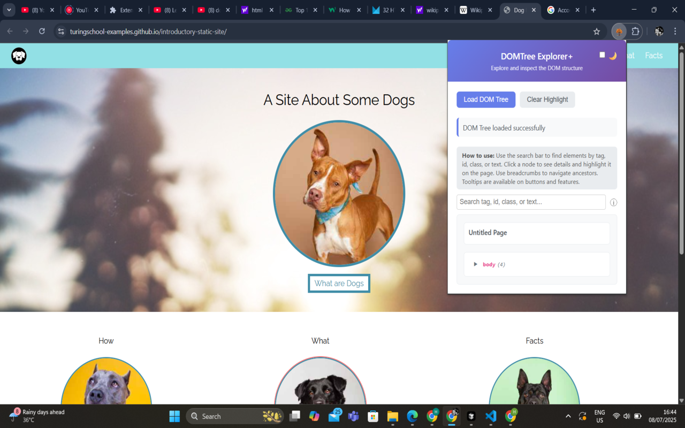
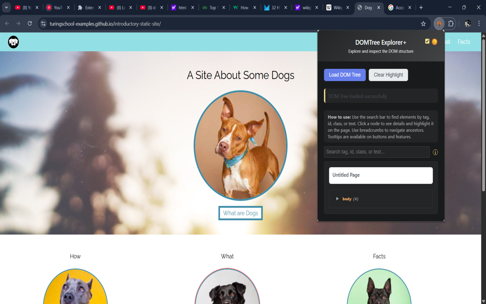
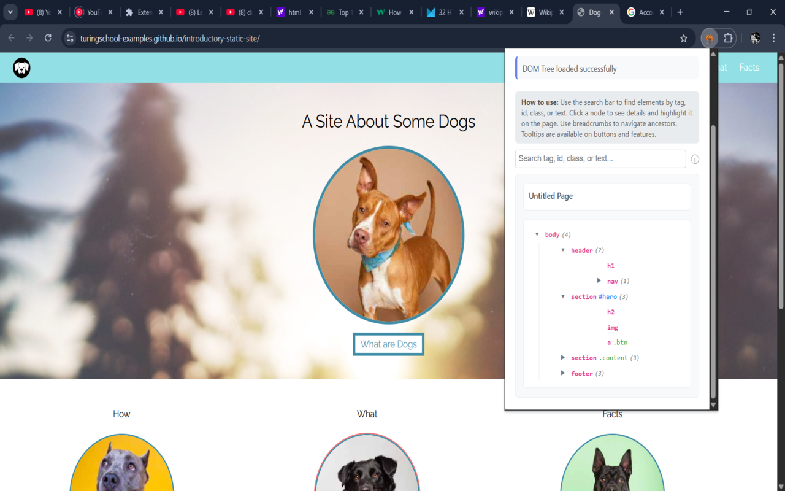
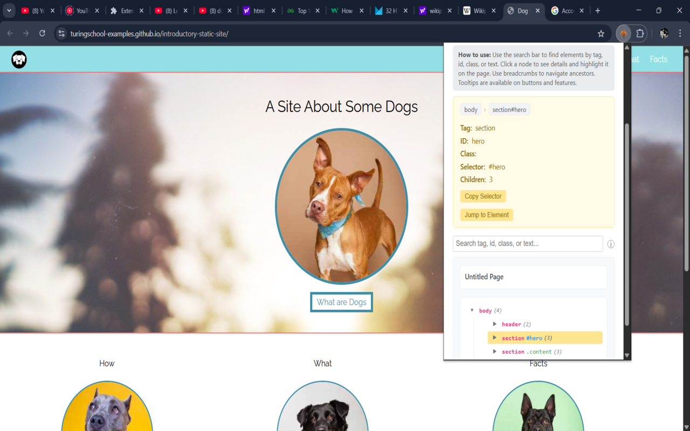

# DOMTree Explorer+

A Chrome extension for visualizing, exploring, and annotating the DOM tree of any web page. Designed for both developers and non-developers, with a modern, user-friendly UI.

---

**This is the final, production-ready version.**

## Features

- **DOM Tree Visualization**: Explore the structure of any web page in a clean, expandable tree view.
- **Element Highlighting**: Click any node to highlight the corresponding element on the page.
- **Details Panel**: See tag, id, class, selector, and children count for any element. Copy the unique selector with one click.
- **Jump to Element**: Instantly scroll the page to the selected element with a single button.
- **Search/Filter**: Quickly find elements by tag, id, class, or text content. Matching nodes are highlighted and auto-expanded.
- **Breadcrumbs Navigation**: See and click the path from the root to the selected element for easy navigation.
- **Dark Mode**: Toggle between light and dark themes for comfortable viewing, with persistent preference.
- **Accessibility Checks**: Get instant warnings for missing alt text, missing labels, or poor color contrast when inspecting elements.
- **User-Friendly for Non-Developers**: Inline guides, tooltips, and a simple interface make it easy for anyone to inspect the DOM.
- **Modern UI**: Responsive, accessible, and visually appealing design.

## How to Use

1. **Install the Extension** and pin it to your Chrome toolbar.
2. **Open any web page** (not a Chrome internal page).
3. **Click the DOMTree Explorer+ icon** to open the popup.
4. **Click "Load DOM Tree"** to visualize the page's DOM structure.
5. **Search/Filter**: Use the search bar to find elements by tag, id, class, or text. Matching nodes are highlighted and expanded.
6. **Explore the Tree**: Expand/collapse nodes to navigate. Click any node to highlight the element and see its details.
7. **Details Panel**: View tag, id, class, selector, and children count. Use the "Copy Selector" button to copy the unique selector.
8. **Jump to Element**: Click the "Jump to Element" button to scroll the page to the selected element.
9. **Breadcrumbs**: Use the breadcrumbs in the details panel to quickly jump to ancestor elements.
10. **Dark Mode**: Use the toggle in the header to switch between light and dark themes.
11. **Accessibility Checks**: When you select an element, see instant warnings for missing alt text, labels, or poor contrast.
12. **Tooltips & Guides**: Hover over buttons and features for helpful tooltips. Read the inline guide at the top for quick instructions.

## Why Use DOMTree Explorer+ Instead of Chrome DevTools?

- **Popup UI**: Always accessible, doesn't cover your page.
- **Simpler for Non-Developers**: No overwhelming panels or jargon.
- **Custom Features**: One-click selector copy, jump to element, breadcrumbs, dark mode, accessibility checks, and more.
- **Great for QA, documentation, and teaching**: Annotate, explore, and share DOM insights easily.

**Enjoy exploring the DOM with ease!** 

## Screenshots

